># What is a Method in js?
>>### A method is a block of code which only runs when it is called You can pass data, known as parameters, into a method. Methods are used to perform certain actions, and they are also known as functions.

***
***
>### Create js strings
>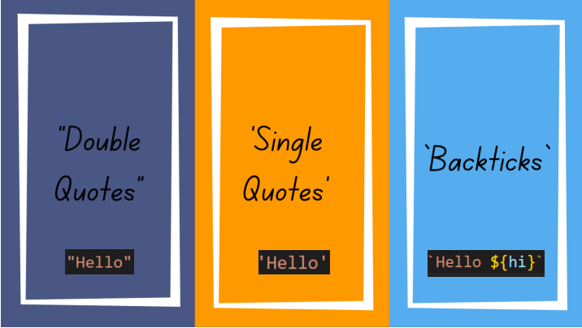

***
***
>### JAVA SCRIPT STRING METHODS
### 1. Метод charAt():
>### С помощью charAt() можно вызват содержаемое в переменной по номеру индекса. Можно вывести толко один индекс.
>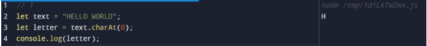
***
### 2. Метод concat():
>### С помощью concat() можно соединить несколько переменных.
>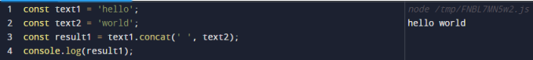

***
### 3. Метод replace():
>### С помощью replace() можно поменять содержимое в переменной.  Первая "ковычки" должно содержить то что мы хотим изменить, а вторая "ковычки"  новое содержимое. 
>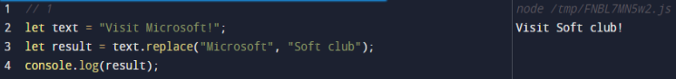

***

### 4. Метод replaceAll():
>### С помощью replaceAll() можно поменять ВСЕ содержимое в переменной.  Первая "ковычки" должно содержить то что мы хотим изменить, а вторая "ковычки"  новое содержимое. 
>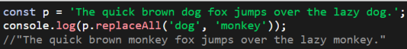

***

### 5. Метод split():
>### С помощью split() можно переделать одно слова на один элемонт. Можно указать до какого индекса действовать.
>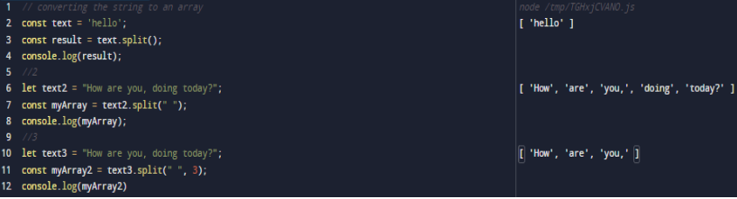

***

### 6. Метод substr():
>### С помощью substr() можно вызвать содержимое в переменной от "начало индекса" до "конец индекса". Можеть принимать  отрецательные числа. Обязательно надо указать начало и конец.
>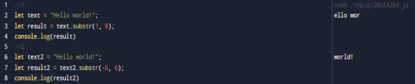

***

### 7. Метод substring():
>### С помощью substring() можно вызвать содержимое в переменной от "начало индекса", принимает только начало индекса. Можеть принимать  отрецательные числа.
>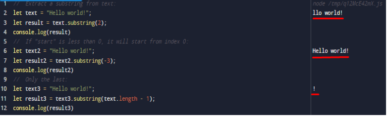

***

### 8. Метод slice():
>### С помощью slice() можно вызвать содержимое в переменной от "начало индекса" до "конца индекса". Делает то что substr() и substring()
>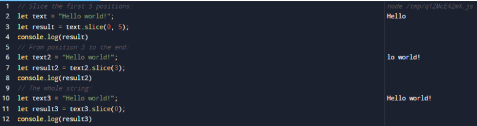

***

### 9. Метод toLowerCase():
>### С помощью toLowerCase() можно сделать все буквы маленькими.
>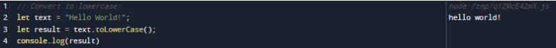

***

### 10. Метод toUpperCase():
>### С помощью toUpperCase() можно сделать все буквы заглавными.
>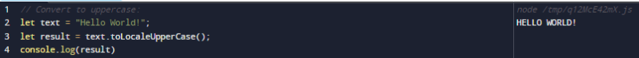

***

### 11. Метод trim():
>### С помощью trim() удаляет слева и справа пробелы.
>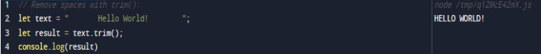

***

### 12. Метод includes():
>### С помощью includes() проверяеть есть ли это "слова" в нашей переменной.
>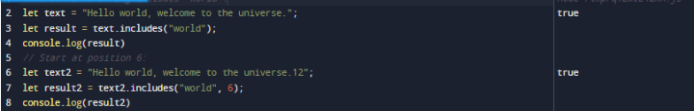

***

### 13. Метод search():
>### С помощью search() проверяеть есть ли это "слова" в нашей переменной, если есть выдает первый индекс от слова которое мы ищем.
>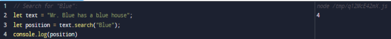

***

### 14. Метод toString():
>### С помощью toString() можно поменять тип переменную на string.
>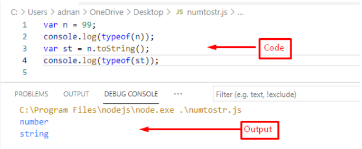

***

### 15. Метод indexOf():
>### С помощью indexOf() делает то что и searche(). Выдает -1 если ничего не найдено.
>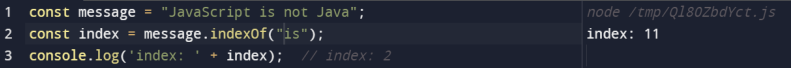

***

### 15. Метод repeat():
>### С помощью repeat() можно повторить то что содержиться в переменной.
>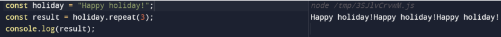

***
***

